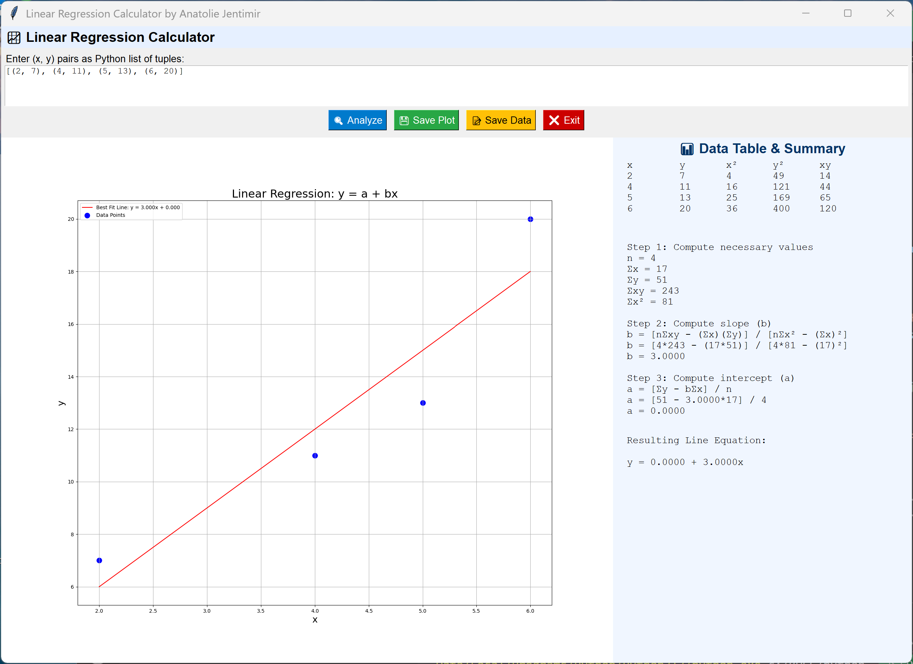

# 📈 Regression Line Analyzer

[](https://github.com/jentimanatol/RegressionLineEquation/releases)
[](LICENSE)

> Developed by **Anatolie Jentimir** – Designed for scientists, researchers, educators, and data enthusiasts.

**Regression Line Analyzer** is a desktop application built with Python and Tkinter to help you **analyze**, **visualize**, and **understand** linear relationships between two variables through correlation and regression. This intuitive app is now being used in scientific labs for data-driven discoveries and innovations.



---


---

## 🔽 Download

📦 Grab the latest stable release:
➡️ **[Download v2.2 for Windows (.exe)](https://github.com/jentimanatol/RegressionLineEquation/releases/download/v2.2/RegressionLineEquation.exe)**

📁 Need older versions or want to check the source code?
🔍 **[Browse all releases](https://github.com/jentimanatol/RegressionLineEquation/releases)**

---


## 🔍 Features

- 📌 **Input**: Paste or type (x, y) pairs as Python-style tuples (e.g. `[(1, 2), (3, 4)]`)
- 📊 **Automatic Computation**:
  - Scatter plot generation
  - Best fit line calculation (via least squares method)
  - Pearson correlation coefficient (r)
- 🧠 **Interpretation**: Clear textual interpretation of the r-value (strength and direction)
- 📑 **Data Summary**: Tabulated view of `x`, `y`, `x²`, `y²`, and `xy`
- 💾 **Save Options**:
  - Export plot as `.png`
  - Export table and summary as `.txt`
- 🧮 **Formula Display**: Mathematical explanation of how r is calculated
- 🌐 **Modern GUI**: User-friendly layout with styled panels and emoji icons

---

## 🧪 Ideal For:

- Research laboratories
- Data science and statistics students
- High school and university educators
- Engineers and analysts
- Anyone who needs quick linear regression with interpretation


---

## 🚀 Getting Started

 download the `.exe` (no Python needed) from [Releases](https://github.com/jentimanatol/RegressionLineEquation/releases) and run it directly on Windows.

---

## ✨ Example Input

```
[(2, 7), (4, 11), (5, 13), (6, 20)]
```

---

## 📷 Screenshot


---

## 🙌 Credits

Made with care and precision by [Anatolie Jentimir](https://github.com/jentimanatol) — 2025.

Special thanks to the scientific community for inspiring this contribution to analytical tools in research.

---

## ⭐ Show Your Support

If you like this tool, consider giving it a ⭐ on GitHub! It motivates us to continue developing open scientific software.

---
